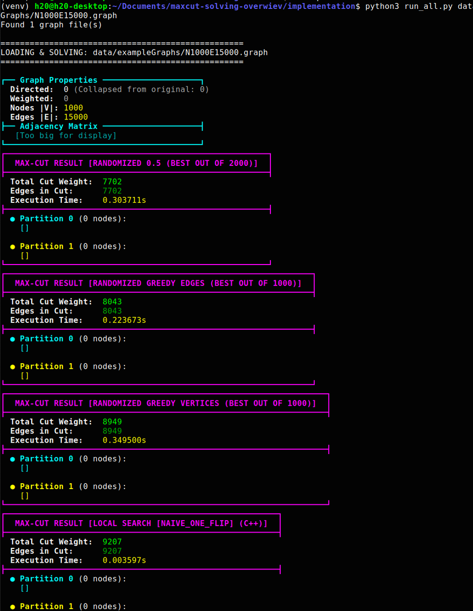
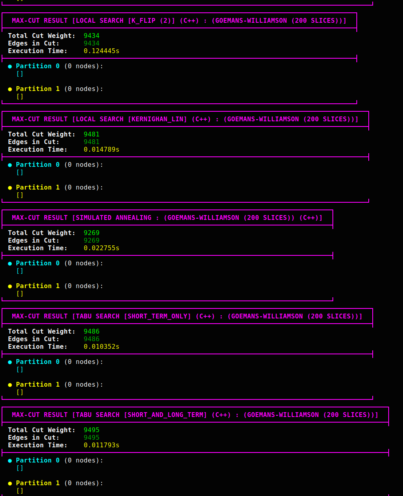
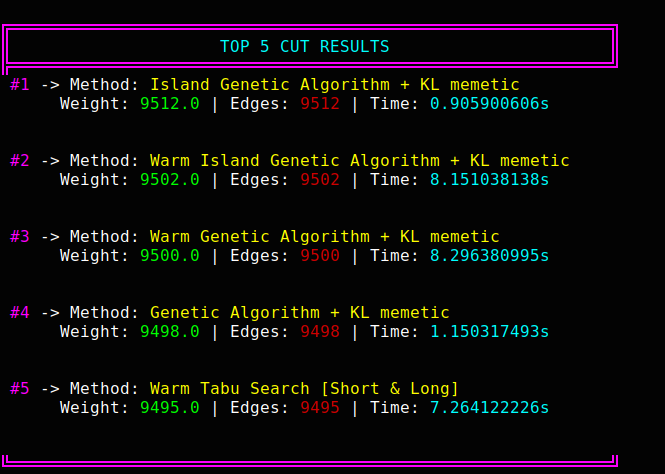

## Overview of different approaches:

### Meta-Heuristics and Memetics:
  - Quantum Annealing
  - Local Search
  - Tabu Search
  - GRASP
  - VNS
  - Kernighan-Lin
  - Genetic
  - Genetic Island
  - Fiduccia–Mattheyses

### Approximations:
  - Goemans–Williamson algorithm
  - Randomized half
  - Randomized greedy edges
  - Randomized greedy vertices

### Exact solutions (solvers):
  - BIP formulation solvers - Gurobi

### Small presentation:

 
