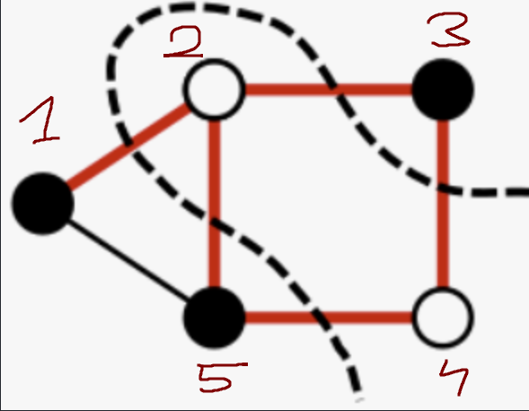

## Graph representation:

Graphs are stored in `*.graph` files with a followig structure:

```
# directed = <bool>
# weighted = <bool>
# vertices = <u_int>
# edges    = <u_int>
/*
    (vertex.id)<u_int>; (target.vertex.id)<u_int>; (weight)<double>
    (vertex.id)<u_int>; (target.vertex.id)<u_int>; (weight)<double>
    (vertex.id)<u_int>; (target.vertex.id)<u_int>; (weight)<double>
    (vertex.id)<u_int>; (target.vertex.id)<u_int>; (weight)<double>
    ...
*/
```

Example:

```
# directed = 0
# weighted = 0
# vertices = 5
# edges    = 6
/*
    1;2;1
    1;5;1
    2;5;1
    2;3;1
    5;4;1
    3;4;1
*/
```
Which corresponds to:



To which optimal solution is:

```
==================================================
LOADING & SOLVING: ../../exampleGraphs/graphs/N5E6.graph
==================================================

--- Optimization Results ---
Status: Optimal Solution Found
Maximum Cut Weight: 5.0
Partition A (v=1): [1, 3, 5]
Partition B (v=0): [2, 4]
```
(solved using MIP and Binary Ineger Programming [look for `methodologies/solvers/main.py`])

